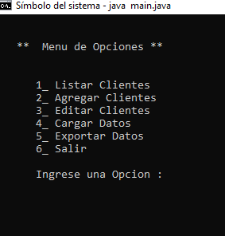
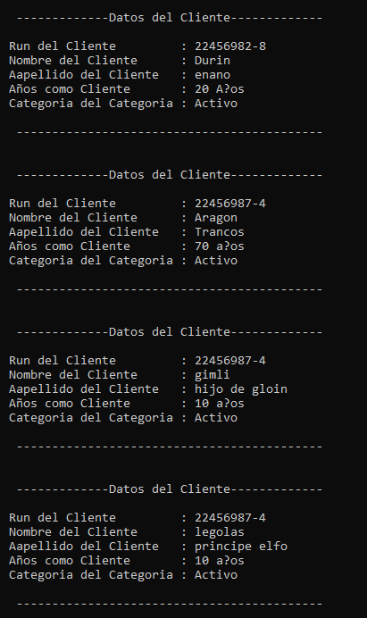
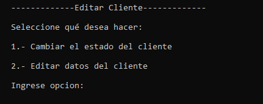

Prueba - Sistema de Clientes
--

En esta prueba validaremos nuestros conocimientos vistos en el módulo.

Lee todo el documento antes de comenzar el desarrollo individual, para asegurarte de tener
el máximo de puntaje y enfocar bien los esfuerzos.

Descripción
-
Durante el último tiempo han ocurrido cambios significativos en nuestras vidas a causa de la
tecnología, los pequeños locales han debido adaptarse a esta nueva necesidad y comenzar a
mudar sus negocios hacia lo electrónico. Es por ello, que la pastelería “Bon Bon Jovi” le ha
contactado a usted para crear un software, donde pueda tener un control de sus clientes,
evitando así que vayan a su local rival “Dominic Completto”. Para esto, debemos considerar
las siguientes funcionalidades:

Menú

Para poder navegar entre las distintas funciones de la aplicación, deberá existir un menú
inicial. El menú permitirá listar, agregar, editar, cargar, exportar datos de clientes y salir de la
sección.

Agregar Cliente

Se debe permitir agregar clientes nuevos e incorporarlos en el listado. Por defecto, deberá
venir la opción ”Activo” en la categoría Cliente, cuando este sea nuevo.

Listar Cliente

Se deben listar a todos los clientes existentes del negocio con su respectiva categoría. En el
ejemplo, se muestra la lista para 2 clientes.

Editar Cliente

Se podrá editar un cliente en caso de tener algún error en sus datos. Para esto, se deberá
ingresar la opción de lo que se busca hacer

En este caso, se buscará cambiar el estado del cliente.

Mientras que en este caso, se quiere cambiar los datos ingresados en un cliente, mediante la
búsqueda por el RUN

Finalmente y en base a la elección del dato a editar, la pantalla arrojará como ejemplo lo
siguiente.

Cargar Datos

Mediante la selección del menú se debe cargar información de los clientes previos del
negocio desde un archivo llamado “DBClientes.csv”.

El archivo “DBClientes.csv” contiene este formato.

Exportar datos

Mediante la selección del menú se debe exportar información de los clientes y sus respectivas
categorías. El archivo debe ser “clientes.txt” o “clientes.csv” dependiendo del formato
elegido.

Dependiendo del formato y del equipo, las rutas quedarán así:

 

Requerimientos
--

1. Crear proyecto en Java.
    (1 Punto)
    
    1.1. Crear un proyecto nuevo a través de Eclipse como proyecto Java.
        Nuevo Proyecto → Proyecto Java → Ingresar nombre proyecto → Finalizar
    
    1.2. Crear 6 paquetes sobre los cuales trabajaremos:

        ● Package main
        ● Package modelo
        ● Package servicio
        ● Package test
        ● Package utilidades
        ● Package vista
    
    1.3. Crear el enum CategoríaEnum en el package Modelo, la cual contendrá 2 posibles valores: Activo e Inactivo.

    1.4. Crear la clase Cliente en package modelo, con los siguientes requisitos: 
        
        ● String runCliente
        ● String nombreCliente
        ● String apellidoCliente
        ● String aniosCliente (se puede cambiar a int si lo desea)
        ● CategoriaEnum nombreCategoria
        ● Generar el constructor con parámetros
        ● Generar los getter y setter correspondientes
        ● Generar el toString para los parámetros
    
    1.5. Crear la clase Main con método public static void en el package main, la cual usará una instancia para iniciar el menú.

2. Utilizar ciclos y métodos. (2 Puntos)

    2.1. Crear clase Menu en el package vistas, que debe contener los siguientes atributos:

        ● clienteServicio, instancia de ClienteServicio.
        ● archivoServicio, instancia de ArchivoServicio.
        ● exportadorCsv, instancia de ExportarCsv.
        ● exportarTxt, instancia de ExportarTxt.
        ● Definir un String fileName = “Clientes”
          (para     exportar el archivo)
        ● Definir un String fileName1 = “DBClientes.csv” 
          (para importar el archivo)
        ● scanner, instancia de Scanner para recibir valores a través del teclado.
        ● iniciarMenu, muestra el menu principal y recibe la entrada del teclado a través del scanner. 

        Contiene la lógica para denotar los demás métodos en base a la entrada del teclado.

    2.2. La clase Menu debe contener los siguientes métodos para la construcción y selección del menu:

        ● listarCliente.
        ● agregarCliente.
        ● editarCliente.
        ● importarDatos.
        ● exportarDatos.
        ● terminarPrograma.

    2.3. Se deben sobreescribir los métodos nombrados previamente en el punto 7, dentro de la misma clase Menú de la siguiente manera:

        ● listarClientes, muestra lista de clientes 
          agregados, ya sea por importación o agregando a mano
        ● agregarCliente, solicita ingreso de datos y llena 
          objeto de tipo Cliente.
        ● editarCliente, permite la edición de algún cliente 
          en caso de requerirlo o cambiar el estado del cliente.
        ● cargarDatos, ejecuta la carga de datos del archivo 
          “DBClientes.csv”. 
        ● exportarDatos, llama a método para exportar 
          Clientes en formato “.txt” o “.csv”.
        ● terminarPrograma, el cual finaliza la ejecución 
          del sistema.

Hint: El único método que no se debe sobreescribir es iniciarMenu, ya que contiene su
implementación al inicio de la clase para formar el menú.

3. Utilizar arreglos y archivos (2 Puntos)

    3.1. Crear la clase ClienteServicio en el package servicio con los siguientes requisitos:

        ● Crear un atributo llamado List<Cliente> listaClientes
        ● Generar un constructor de ClienteServicio que tenga esta listaClientes como una nueva ArrayList.
        ● Generar el método público sin valor de retornolistarClientes e implementar el ciclo más idóneo 
          para recorrer cada uno de los clientes.
        ● Generar un public void del método agregarCliente y pasarle los parámetros de la clase Cliente. 
          Utiliza este método para guardar clientes en una instancia de cliente.
        ● Generar un public void del método editarCliente y pasarle los parámetros de la clase Cliente.
        ● Crear un getter de listaCliente y que pueda retornar una listaClientes.

4. Aplicar Polimorfismo y Herencia según el Paradigma Orientado a Objetos (POO) (2 Puntos)

    4.1. Crear una clase abstracta de nombre Exportador en package Servicio, que
         contenga un método abstracto para exportar, cuyos parámetros serán String fileName y List<Cliente> listaClientes.

    4.2. Crear una clase ExportadorCsv en el package servicio, que contenga un método exportar, cuyos parámetros serán String fileName 
         y una List<Cliente> listaClientes. 
         Se deben realizar las implementaciones correspondientes al interior del método usando PrintWriter y Filewriter para la exportación de archivos.

    4.3. Crear una clase ExportadorTxt en el package servicio, que contenga un método exportar, 
         cuyos parámetros serán String fileName y una List<Cliente> listaClientes. 
         Se deben realizar las implementaciones correspondientes al interior del método usando 
         PrintWriter y Filewriter para exportación de archivos.

Hint: Los pasos 8, 9 y 10 buscan tener una clase abstracta (Exportador), con un solo método exportar, 
      cuyas clases ExportadorCsv y ExportadorTxt extienden de esta clase e implementar su método. 
      Por lo tanto, los métodos declarados serán pertenecientes a cada Exportador bajo el concepto de herencia. 
      Al utilizarlo, se instancia alguno de los exportadores en la clase menu ocupando polimorfismo.

5. Aplicar instancias al Paradigma Orientado a Objetos (POO) (2 Puntos)

    5.1. Crear la clase ArchivoServicio en el package servicio que extiende a la clase Exportador. 
         
         Esta contiene los siguientes requisitos:

            ● Crear el método cargarDatos que recibe por parámetro un String fileName, 
              el cual indica el nombre del archivo a cargar. Se deben realizar las implementaciones 
              correspondientes al interior del método usando FileReader y BufferedReader (para lectura de archivos).
            ● Crear el método exportar que será una herencia proveniente de la clase Exportador, 
              cuyos parámetros serán los mismos que se van a implementar en el paso 8.

    5.2. Crear una clase Utilidad en package utilidades, que contenga métodos reutilizables 
        para el menú como limpiar pantalla, mostrar mensajes, etc.

6. Aplicar pruebas unitarias (1 Punto)
    
    6.1. Añadir dependencias para pruebas Unitarias, ver ejemplo en apartado Anexos
         al final del documento.

    6.2. Escribir pruebas unitarias para ClienteServicio.

        ● Método agrearClienteTest para verificar el funcionamiento de agregarCliente
          (se debe agregar un cliente para que el test corra de manera correcta)
        ● Método agrearClienteNullTest para verificar el funcionamiento de agregarCliente 
          en caso que vengan casos nulos (se debe agregar un cliente nulo para que el test corra de 
          manera correcta).

Mucho éxito!

Imagenes del proyecto Realizado :
--

para correr el programam se debe crear la carpeta Clientes en la Raiz C: y Agregar el archivo a importar que se agrega al repositorio

Imagen de testeo ok 
 
